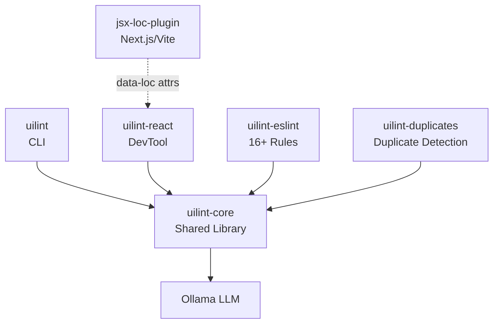
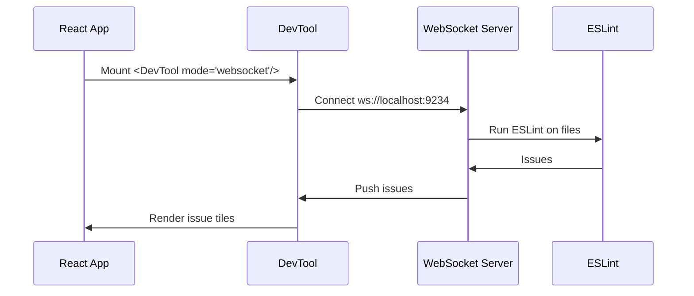

# UILint Architecture

AI-powered UI consistency checker for React/Next.js. Scans code for design inconsistencies using local LLMs (Ollama), auto-generates style guides, and integrates via CLI, React DevTool, and ESLint plugin.

## Package Structure



## Analysis Data Flow

```mermaid
flowchart LR
    subgraph Input
        HTML[HTML/DOM]
        Source[TSX/JSX]
    end
    subgraph Core
        Scanner[Scanner] --> Extract[Style Extractor]
        Extract --> Prompt[Prompt Builder]
    end
    subgraph LLM
        Prompt --> Ollama[Ollama]
        Ollama --> Parse[Response Parser]
    end
    Parse --> Issues[UILintIssue[]]

    HTML --> Scanner
    Source --> Scanner
```

## DevTool WebSocket Flow



## Key Directories

| Package | Path | Purpose |
|---------|------|---------|
| **uilint** | `packages/uilint/` | CLI commands |
| **uilint-core** | `packages/uilint-core/` | Shared: types, LLM client, scanner |
| **uilint-react** | `packages/uilint-react/` | React DevTool component |
| **uilint-eslint** | `packages/uilint-eslint/` | ESLint plugin & rules |
| **uilint-duplicates** | `packages/uilint-duplicates/` | Semantic duplicate detection |
| **jsx-loc-plugin** | `packages/jsx-loc-plugin/` | Babel transform for data-loc |

## Entry Points

| File | What It Does |
|------|--------------|
| `packages/uilint/src/index.ts` | CLI command definitions (Commander.js) |
| `packages/uilint-core/src/index.ts` | Browser-safe exports |
| `packages/uilint-core/src/node.ts` | Node.js exports (JSDOM, Ollama bootstrap) |
| `packages/uilint-react/src/DevTool.tsx` | Main React DevTool component |
| `packages/uilint-eslint/src/index.ts` | ESLint plugin & rule registry |

## Core Types

```typescript
// Style guide structure (.uilint/styleguide.md parsed form)
interface StyleGuide {
  colors: { name: string; value: string; usage: string }[];
  typography: { element: string; fontFamily?: string; fontSize?: string; fontWeight?: string }[];
  spacing: { name: string; value: string }[];
  components: { name: string; styles: string[] }[];
}

// Analysis result from LLM
interface UILintIssue {
  id: string;
  type: "color" | "typography" | "spacing" | "component" | "responsive" | "accessibility";
  message: string;
  element?: string;
  selector?: string;
  currentValue?: string;
  expectedValue?: string;
  suggestion?: string;
}

// Lightweight issue for source scanning
interface UILintScanIssue {
  line?: number;
  message: string;
  dataLoc?: string; // "path:line:column"
}
```

## Common Tasks

### Add an ESLint Rule
1. Create `packages/uilint-eslint/src/rules/my-rule.ts`
2. Use `createRule()` from `utils/create-rule.ts`
3. Add to `rule-registry.ts` (auto-indexed)
4. Run `pnpm build` in uilint-eslint

### Modify DevTool UI
1. Components in `packages/uilint-react/src/ui/`
2. State in `packages/uilint-react/src/core/store/`
3. Plugins in `packages/uilint-react/src/plugins/`

### Add a CLI Command
1. Add command in `packages/uilint/src/index.ts`
2. Create handler in `packages/uilint/src/commands/`
3. Use core functions from `uilint-core`

### Modify LLM Prompts
1. Analysis prompts: `packages/uilint-core/src/ollama/prompts.ts`
2. Style guide: `packages/uilint-core/src/styleguide/`

## Build Commands

```bash
pnpm build:packages  # Build all packages
pnpm test            # Run all tests
pnpm lint            # ESLint check
pnpm typecheck       # TypeScript check
```

## Config Files

- `.uilint/styleguide.md` - Style guide (user creates manually)
- `eslint.config.ts` - ESLint config per package
- `pnpm-workspace.yaml` - Monorepo workspace
